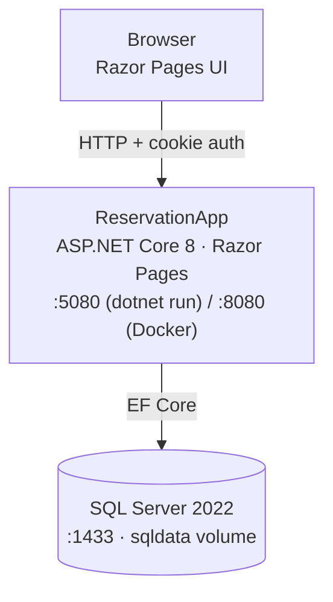

# ReservationApp

A restaurant reservation system: admins manage a restaurant listing, customers browse it and book a table for a date. Built as a learning project — ASP.NET Core fundamentals (Razor Pages, EF Core, Identity) end to end.

**Flow: Customer → Browse Restaurants → Reserve a Date → Admin Manages Listings & Capacity**

---

## Architecture



Two roles, enforced via ASP.NET Identity:
- **admin** — create/edit/delete restaurants
- **client** — browse restaurants, create/cancel reservations

---

## Stack

| Layer | Tech |
|---|---|
| Backend | ASP.NET Core 8 (Razor Pages) |
| ORM | Entity Framework Core 8 |
| Database | SQL Server 2022 |
| Auth | ASP.NET Identity — cookie-based, role: `admin` / `client` |
| Frontend | Razor Pages + Bootstrap 5 + jQuery |
| Containerization | Docker + Docker Compose |

---

## Use Case

A small/medium restaurant (or a group of them, as seeded here) needs a simple booking system:

- **Admin** maintains the restaurant list: name, category, address, capacity, photo.
- **Customer** registers, browses restaurants, and reserves a table for a specific date and party size.
- Capacity is enforced per restaurant per day — a reservation is rejected if it would exceed the restaurant's capacity.
- Past dates cannot be booked.

---

## Quick Start

**Requires:** .NET 8 SDK, Docker Desktop

### Option A — Local dev (hot-reload)
```bash
docker compose up -d sqlserver
cd ReservationApp
dotnet user-secrets set "ConnectionStrings:DefaultConnection" "Server=localhost,1433;Initial Catalog=ReservationData;User ID=sa;Password=<your-local-password>;TrustServerCertificate=True;"
dotnet user-secrets set "SeedAdmin:Email" "admin@reservationapp.local"
dotnet user-secrets set "SeedAdmin:Password" "<your-choice>"
dotnet ef database update
dotnet run
```
→ http://localhost:5080

### Option B — Fully containerized
```bash
cp .env.example .env   # fill in SA_PASSWORD, SEED_ADMIN_EMAIL, SEED_ADMIN_PASSWORD
docker compose up --build
```
→ http://localhost:8080

An admin account is seeded automatically on first run (`Development` environment only), using the credentials from `user-secrets`/`.env` above.

---

## Troubleshooting

| Issue | Solution |
|---|---|
| `dotnet ef` not found | `dotnet tool install --global dotnet-ef` |
| Migration fails to connect | Make sure the `sqlserver` container is up: `docker ps` |
| Login fails as admin | Confirm `SeedAdmin:Email`/`Password` are set and `ASPNETCORE_ENVIRONMENT=Development` |
| Restaurant images missing | Add `.jpg`/`.png` files to `wwwroot/Restaurant_Img/` matching seeded `ImageFileName` values |

---

## Project Status

Pre-production demo / learning project. See [CHANGELOG.md](CHANGELOG.md) for version history.
